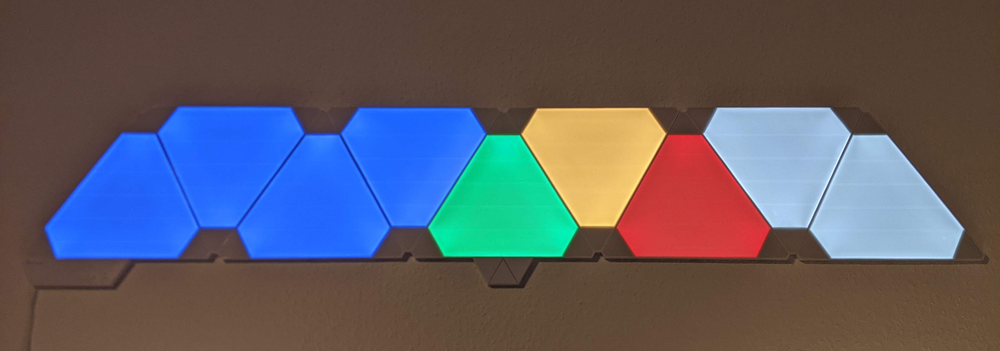

# NanoleafTimer

## Overview

*What will this Script do?*  

It lets you create a light timer with your Nanoleaf.  
You can use as many panels as u want and maybe also the newer panels like Canvas, but I only tested it with 9 Aurora Panels.  

The color of a panels shows it's time value.  
I chose some not super bright colors.  
U can change the color easily by adjusting the rgb values.  
blue =  30 minutes left  
green = 15-29 minutes left  
yellow = 10-14 minutes left  
orange = 5-9 minutes left  
red = 1-4 minutes left  
white = 0 minutes left  
 

## Configuration

1. Change the IP Adress `nl = Nanoleaf("192.168.69.6")`
2. Bring your Nanoleaf in pairing mode by holding the power button for 5-7 seconds, till the white light starts flashing
3. Run the once to get an access token  (it will be stored automatic)
4. Enter the panel ids in right order (ex. left to right) into `panel_ids = ["87", "193", "11", "25", "141", "111", "62", "202", "52"]`
   The ids will be printed in the log on step 3
5. Run the script again with minute count `python3 nanoleafTimer.py 10`

I also connected it with the google assistant over IFTTT and a webhook. Just ask if u want me to explain how to set it up the same way.
